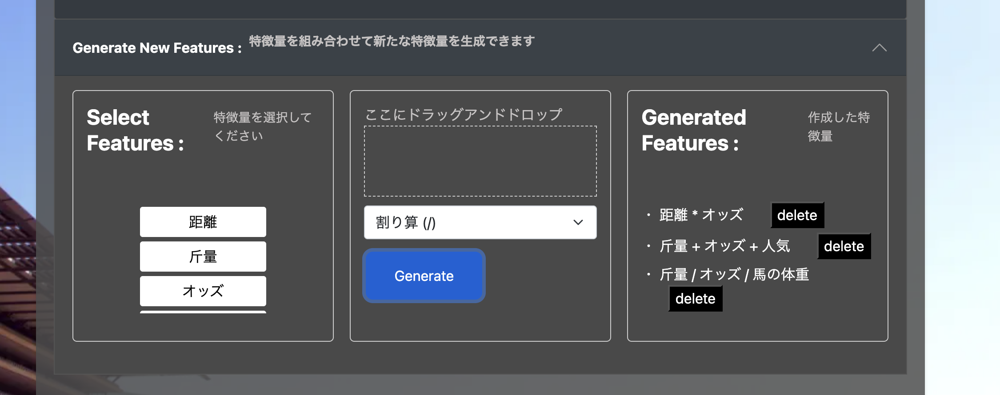
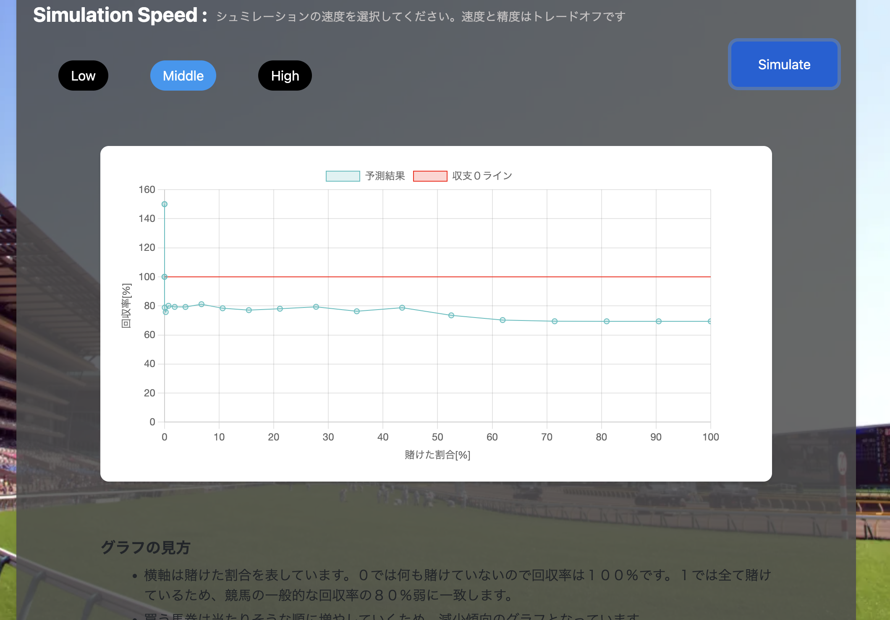
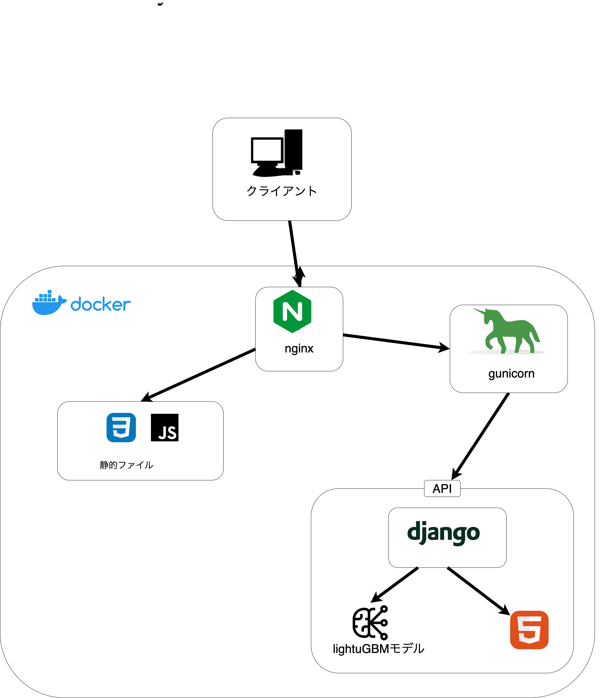

<p align="center"><h1 align="center">horse simulator</h1></p>

<p align="center">カスタム特徴量での機械学習競馬シミュレーションwebアプリ</p>

<p align="center"><a href="./LICENSE"></a></p>

<br>

## Contents

- [Overview](#overview)

- [Features](#features)

- [Technology Stack](#technology-stack)

- [Getting Started](#getting-started)

- [License](#license)

---





## Overview

競馬に関する特徴量を組み合わせることにより特徴量をWEBから作成でき、それをもとに学習させた機械学習モデルを実際の競馬のデータを持ちてシミュレーションすることができる

---

## Features

- **Web UI:** 直感的なWebインターフェースでシミュレーションのパラメータを設定可能である。

- **特徴量選択:** 複数の競馬関連特徴量（斤量、人気、騎手勝率など）から、モデルに投入するものを自由に選択できる。

- **特徴量生成:** 選択した特徴量を組み合わせて、新しい特徴量を動的に生成する機能を持つ。

- **機械学習モデル:** `LightGBM`（勾配ブースティング）による回帰モデルを実装している。

- **結果の可視化:** 賭けた割合に対する回収率の変化を折れ線グラフで表示する。

---

## Architecture


---
## Getting Started

### Prerequisites

- **docker** (`29.1.3` or later)
- **docker compose** (`5.0.1` or later)

### Installation

```sh
❯ git clone https://github.com/icchon/horse_sumilator
❯ cd horse_sumilator
❯ cp .env.example .env
❯ docker-compose up --build -d
```
その後、 `http://localhost/` にアクセス

---

## License

This project is licensed under the MIT License - see the [LICENSE](./LICENSE) file for details.

© 2025 icchon
